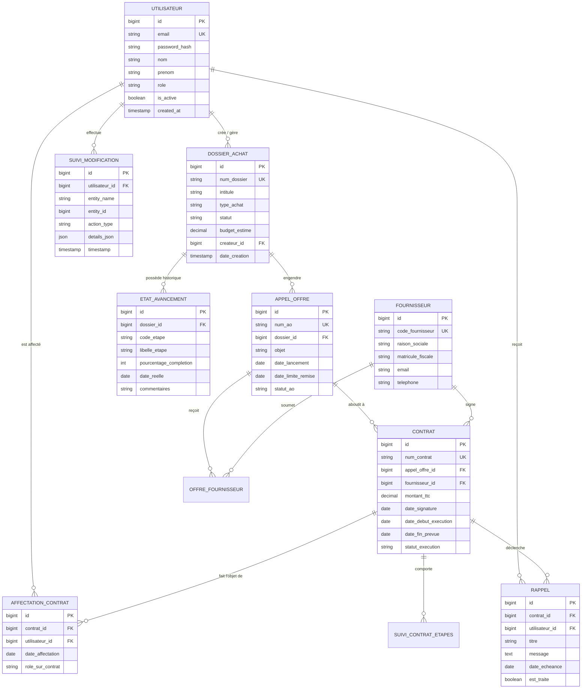

# RAPPORT TECHNIQUE ET ARCHITECTURAL DE MIGRATION
## Passage d'Oracle APEX (v24.2 / PL/SQL) vers Node.js & React (Full-Stack JS/TS)
**Projet :** Suivi Des Dossiers v2.3 (AGP - Suivi des Appels d'Offres & Contrats)
**Auteur :** Équipe d'Architecture & Ingénierie Logicielles
**Date :** Septembre 2026

---

## 1. INTRODUCTION ET EXECUTIVE SUMMARY

### 1.1 Contexte du Projet
L'application **"Suivi Des Dossiers v2.3"** (code interne `AGP` / `SUIVI_DES_APPELS_D_OFFRES177924`), développée à l'origine sous **Oracle APEX 24.2.0**, constitue le noyau opérationnel de gestion des appels d'offres, des dossiers d'achats, des contrats, du suivi d'avancement des marchés et des plannings d'exécution.

Afin de moderniser l'infrastructure, d'améliorer l'évolutivité, de garantir l'indépendance vis-à-vis des licences Oracle, et de fournir une expérience utilisateur (UX) sur-mesure ultra-réactive, la direction informatique a acté la migration complète vers une pile technologique moderne découplée : **Node.js (Backend REST/GraphQL) & React (Frontend SPA/PWA)**.

### 1.2 Métriques Clés du Système Source (Oracle APEX)
D'après l'analyse rigoureuse du fichier d'export SQL APEX (`Suivi Des Dossiers v2.3`) :
* **Workspace / Owner :** `WKSP_GCT` (Parsing Schema: `WKSP_GCT`)
* **Nombre de Pages APEX :** 82 pages
* **Composants d'Interface (Items) :** 588 items de formulaire/filtres
* **Régions d'Affichage :** 252 régions (Interactive Reports, Forms, Dashboards, Cards)
* **Boutons & Actions Dynamiques :** 126 boutons et 161 Dynamic Actions (DA)
* **Processus Applicatifs (Processes) :** 133 PL/SQL On-Submit/AJAX processes
* **Listes de Valeurs (LOVs) & Listes Nav :** 10 LOVs globales, 10 Listes de navigation structurées
* **Fonctionnalités PWA :** Manifeste PWA, Shortcuts (`AGP`), Notifications Push (Credentials WebPush VAPID)

---

## 2. ARCHITECTURE DE LA NOUVELLE PLATEFORME (NODE.JS / REACT)

### 2.1 Stack Technologique Cible
* **Frontend :** React 18+ (TypeScript), Vite, TailwindCSS / Shadcn UI, React Query (TanStack), React Router v6, Lucide Icons.
* **Backend :** Node.js 20+ LTS, Express.js / NestJS (TypeScript), Prisma ORM / PostgreSQL (ou Oracle Database via `node-oracledb` si conservation de la base de données).
* **Sécurité & Authentification :** JWT / OAuth2 / Argon2, RBAC (Role-Based Access Control) natif.
* **Notifications & PWA :** Service Workers, WebPush API (VAPID), Socket.io (suivi en temps réel).

```
+-----------------------------------------------------------------------+
|                         REACT FRONTEND (PWA)                          |
|  +--------------------+  +--------------------+  +-----------------+  |
|  |  Tableau de Bord   |  | Dossiers & Achats  |  | Contrats & DA   |  |
|  +--------------------+  +--------------------+  +-----------------+  |
|  | React Query / Axios|  | Zustand State      |  | Service Worker  |  |
+-----------------------------------------------------------------------+
                                   | (REST API / JSON / WebSockets)
                                   v
+-----------------------------------------------------------------------+
|                          NODE.JS BACKEND API                          |
|  +--------------------+  +--------------------+  +-----------------+  |
|  | Express/Nest Auth  |  | Controllers & BLL  |  | WebPush Manager |  |
|  +--------------------+  +--------------------+  +-----------------+  |
|  | Middleware RBAC    |  | Prisma ORM Layer   |  | Validation Zod  |  |
+-----------------------------------------------------------------------+
                                   | SQL Queries
                                   v
+-----------------------------------------------------------------------+
|                         BASE DE DONNEES TARGET                        |
|  (PostgreSQL / Oracle DB - Schéma Relationnel Normalisé 3NF)          |
+-----------------------------------------------------------------------+
```

---

## 3. DIAGRAMME RELATIONNEL DE LA BASE DE DONNÉES (ERD)

L'analyse de l'export APEX et des modules (`Dossiers`, `Contrats`, `Appels d'Offres`, `Utilisateurs`, `Rappels`, `Suivi Modifications`) permet de modéliser le schéma relationnel cible sous forme Mermaid et UML ASCII.

### 3.1 Représentation Mermaid des Entités Cibles



---

## 4. CORRESPONDANCE DES MODULES ET STRATÉGIE DE REFACTORING

### 4.1 Mappage des Pages APEX vers Composants React / API Node.js

| Page APEX ID / Libellé Source | Module Métier Cible | Composant React Cible | Route API Node.js (Express/Nest) |
| :--- | :--- | :--- | :--- |
| **Page 44 :** Tableau de bord des Dossiers | Dashboard Analytics | `<DashboardDossiers />` | `GET /api/v1/dashboard/stats` |
| **Page 1 :** Page d'accueil | Home / Landing | `<HomePage />` | `GET /api/v1/user/summary` |
| **Page 2 :** Etat - Appels D’Offres En Cours | Appels d'Offres | `<AppelsOffresList status="EN_COURS" />` | `GET /api/v1/appels-offres?status=IN_PROGRESS` |
| **Page 3 :** Recherche - APPEL D’OFFRES | Recherche Avancée | `<AppelOffreSearchFilter />` | `POST /api/v1/appels-offres/search` |
| **Page 5 :** Calendrier | Planning / Agenda | `<CalendarView />` | `GET /api/v1/events/calendar` |
| **Page 6 :** Créer un Nouveau Appel d'Offres | Création AO | `<AppelOffreFormWizard />` | `POST /api/v1/appels-offres` |
| **Page 21 & 25 :** Suivi & État Avancement | Avancement Dossiers | `<DossierStepperProgress />` | `GET /api/v1/dossiers/:id/advancement` |
| **Page 26 & 7 :** Suivi des Modifications | Audit & Logs | `<AuditLogsTable />` | `GET /api/v1/audit-logs` |
| **Page 30, 35, 43 :** Contrats (Suivi / En Cours) | Gestion Contrats | `<ContratsDataGrid />` | `GET /api/v1/contrats` |
| **Page 32 :** Gestion des Rappels | Notification Center | `<RemindersManager />` | `GET /api/v1/reminders`, `PUT /api/v1/reminders/:id` |
| **Page 39 :** Affectation des Contrats | Resource Allocation | `<ContractAssignmentModal />` | `POST /api/v1/contrats/affectation` |
| **Page 11, 12, 13, 10041 :** Gestion de Comptes / Users | User & Access Mgmt | `<UserManagementAdmin />` | `GET/POST/PUT /api/v1/users` |

---

## 5. MIGRATION DE LA LOGIQUE MÉTIER PL/SQL VERS NODE.JS

### 5.1 Exemple 1 : Validation et Transition d'État d'un Appel d'Offres

#### Code Source APEX (PL/SQL Legacy)
```sql
-- Processus PL/SQL On-Submit APEX
BEGIN
    IF :P6_DATE_LIMITE < SYSDATE THEN
        raise_application_error(-20001, 'La date limite doit être dans le futur.');
    END IF;

    UPDATE APPEL_OFFRES
    SET OBJET = :P6_OBJET,
        DATE_LIMITE = :P6_DATE_LIMITE,
        STATUT = 'PUBLIE',
        LAST_UPDATED_BY = :APP_USER,
        LAST_UPDATED_ON = SYSDATE
    WHERE ID = :P6_ID;

    INSERT INTO SUIVI_MODIF(USER_ID, ACTION, ENTITY_ID)
    VALUES (:APP_USER, 'UPDATE_AO', :P6_ID);
END;
```

#### Code Cible Node.js / TypeScript (Controller + Service Prisma)
```typescript
// appels-offres.service.ts
import { Injectable, BadRequestException } from '@nestjs/common';
import { PrismaService } from '../prisma/prisma.service';
import { UpdateAppelOffreDto } from './dto/update-ao.dto';

@Injectable()
export class AppelsOffresService {
  constructor(private prisma: PrismaService) {}

  async updateAndPublishAO(id: number, dto: UpdateAppelOffreDto, userId: number) {
    if (new Date(dto.dateLimite) <= new Date()) {
      throw new BadRequestException('La date limite doit être dans le futur.');
    }

    return await this.prisma.$transaction(async (tx) => {
      const updatedAo = await tx.appelOffre.update({
        where: { id },
        data: {
          objet: dto.objet,
          dateLimiteRemise: dto.dateLimite,
          statutAo: 'PUBLIE',
        },
      });

      await tx.suiviModification.create({
        data: {
          utilisateurId: userId,
          entityName: 'APPEL_OFFRE',
          entityId: id,
          actionType: 'UPDATE_AO',
          detailsJson: JSON.stringify(dto),
        },
      });

      return updatedAo;
    });
  }
}
```

---

## 6. MIGRATION DU SYSTEME DE NOTIFICATION PWA & VAPID

Le script APEX comporte les identifiants PWA :
* `p_pwa_is_push_enabled => 'Y'`
* `pwa_push_credential_id => 2339870460409346`

### Implémentation Node.js (WebPush / VAPID)
```typescript
import webpush from 'web-push';

webpush.setVapidDetails(
  'mailto:chr277158@gmail.com',
  process.env.VAPID_PUBLIC_KEY!,
  process.env.VAPID_PRIVATE_KEY!
);

export async function sendReminderNotification(subscription: any, payload: object) {
  try {
    await webpush.sendNotification(subscription, JSON.stringify(payload));
  } catch (error) {
    console.error('Erreur d'envoi WebPush:', error);
  }
}
```

---

## 7. PLAN D'EXÉCUTION ET FEUILLE DE ROUTE (ROADMAP)

1. **Phase 1 : Conception & Setup Infrastructure (Semaines 1-3)**
   * Validation du schéma relationnel PostgreSQL / Oracle DB.
   * Initialisation du monorepo / repos (Node.js API + React App).
   * Mise en place des pipelines CI/CD, ESLint, Prettier, Jest.
2. **Phase 2 : Développement Backend Core & API (Semaines 4-8)**
   * Authentification JWT + RBAC (Admin, Gestionnaire, Consultateur).
   * Endpoints RESTful pour Dossiers, Appels d'Offres, Contrats, Avancement.
   * Logger d'audit automatisé via Middlewares.
3. **Phase 3 : Développement Frontend React (Semaines 9-14)**
   * Implémentation du Design System (TailwindCSS / Shadcn UI).
   * Composants formulaires réutilisables (React Hook Form + Zod).
   * Tableaux de bord, vues DataGrid interactives, Calendrier, Steppers.
4. **Phase 4 : PWA, Push Notifications & Offline Support (Semaines 15-16)**
   * Configuration du Service Worker (Workbox).
   * Enregistrement des crédentiels Push Notifications.
5. **Phase 5 : Recette, Tests & Bascule (Semaines 17-18)**
   * Migration des données historiques (ETL Scripts SQL -> Postgres/Oracle).
   * Tests de charge et de sécurité (OWASP Top 10).
   * Déploiement Production & Maintien temporaire en parallèle APEX/React.

---
*Fin du document de Migration - Version 1.0 (Validé par l'Architecte Système)*
